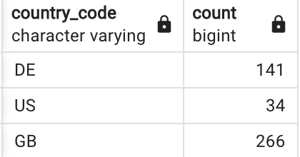
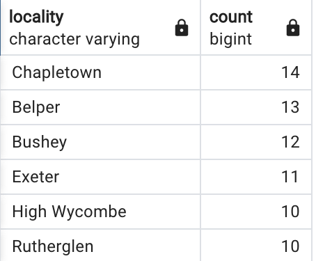
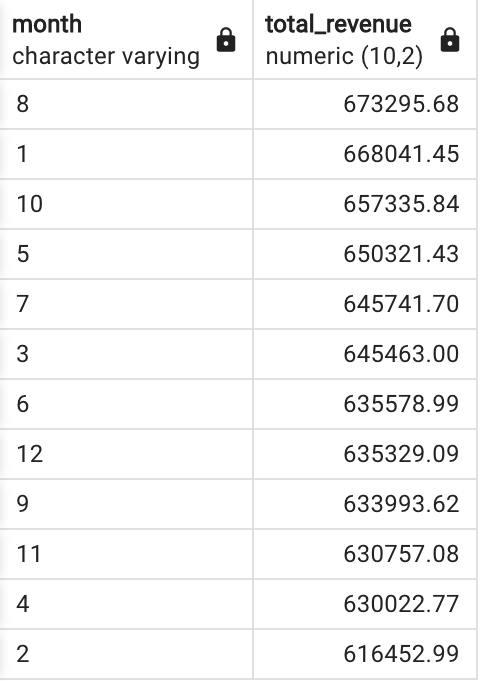
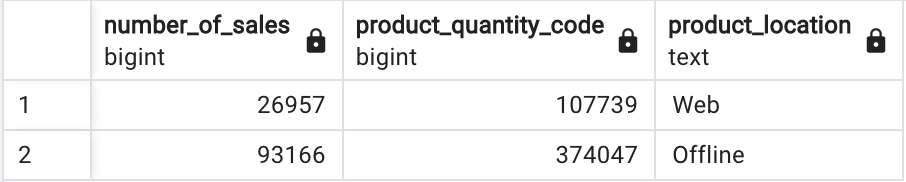
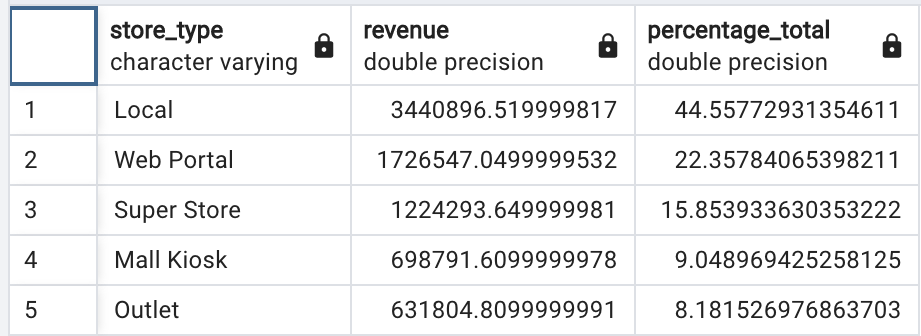
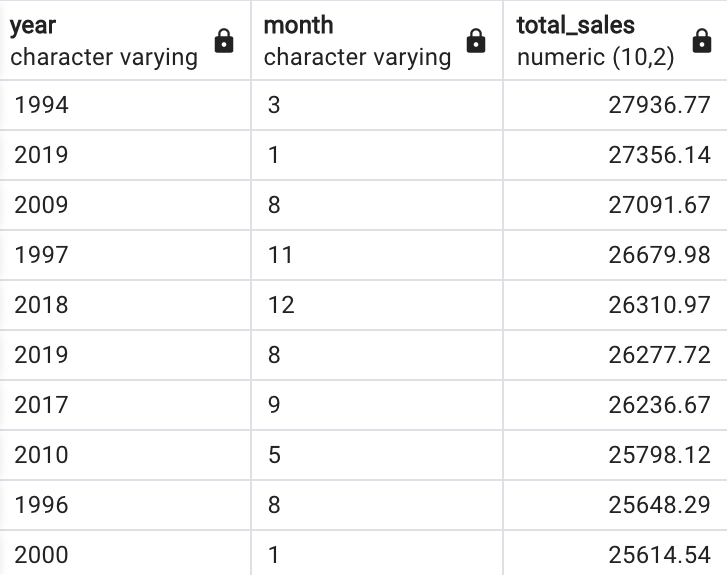
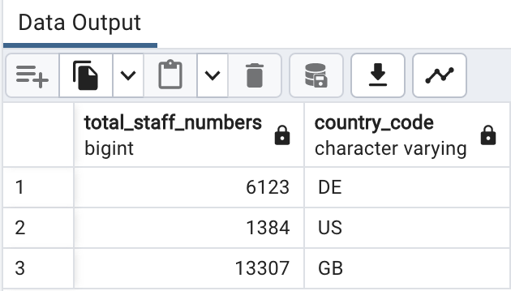
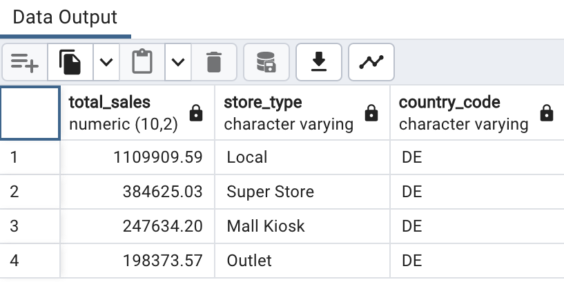
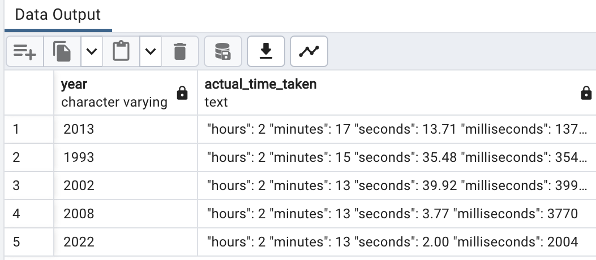

### 1) How many stores does the business have and in which countries?
```sql
SELECT country_code, COUNT(*) FROM dim_store_details GROUP BY country_code;
```
### output:


### 2) Which locations currently have the most stores?

```sql
SELECT locality, COUNT (*) FROM dim_store_details GROUP BY locality	ORDER BY COUNT(*) DESC;
```
### output:


### 3) Which months produce the average highest cost of sales typically?
```sql
SELECT dim_date_times.month,
CAST (SUM(orders_table.product_quantity*dim_products.product_price) AS decimal(10, 2)) AS total_revenue
FROM orders_table
JOIN dim_date_times ON orders_table.date_uuid = dim_date_times.date_uuid
JOIN dim_products ON orders_table.product_code = dim_products.product_code
GROUP BY dim_date_times.month
ORDER BY SUM(orders_table.product_quantity * dim_products.product_price) DESC;
```

### output:

### 4) How many sales are coming from online? 

```sql
SELECT COUNT (orders_table.product_quantity) AS number_of_sales, SUM(orders_table.product_quantity) AS product_quantity_code,
    CASE
            WHEN dim_store_details.store_code = 'WEB-1388012W' then 'Web'
            ELSE 'Offline'
    END AS product_location
FROM orders_table
JOIN dim_date_times ON orders_table.date_uuid = dim_date_times.date_uuid
JOIN dim_products ON orders_table.product_code = dim_products.product_code
JOIN dim_store_details ON orders_table.store_code = dim_store_details.store_code
GROUP BY product_location
ORDER BY sum(orders_table.product_quantity) ASC;
```
### output:


### 5) What percentages of sale come through each type of store?

```sql
SELECT dim_store_details.store_type,
SUM(orders_table.product_quantity * dim_products.product_price) as revenue,
SUM(100.0*orders_table.product_quantity*dim_products.product_price) / (SUM(SUM(orders_table.product_quantity*dim_products.product_price)) OVER ()) AS percentage_total
FROM orders_table
JOIN dim_date_times ON orders_table.date_uuid = dim_date_times.date_uuid
JOIN dim_products ON orders_table.product_code = dim_products.product_code
JOIN dim_store_details ON orders_table.store_code = dim_store_details.store_code
GROUP BY dim_store_details.store_type
ORDER BY percentage_total DESC;
```

### output:


### 6) Which month in each year produced the highest cost of sales?

```sql
SELECT dim_date_times.year, dim_date_times.month,
CAST(SUM(orders_table.product_quantity * dim_products.product_price) AS decimal(10, 2)) AS total_sales
FROM orders_table
JOIN dim_date_times ON orders_table.date_uuid = dim_date_times.date_uuid
JOIN dim_products ON orders_table.product_code = dim_products.product_code
JOIN dim_store_details ON orders_table.store_code = dim_store_details.store_code
GROUP BY dim_date_times.year, dim_date_times.month
ORDER BY CAST(SUM(orders_table.product_quantity * dim_products.product_price) AS decimal(10, 2)) DESC;
```

### output:


### 7) What is our staff headcount?

```sql
SELECT SUM(staff_numbers) AS total_staff_numbers, country_code
FROM dim_store_details
GROUP BY country_code;
```

### output:


### 8) Which German store type is selling the most? 

```sql
SELECT CAST(SUM(orders_table.product_quantity * dim_products.product_price) AS decimal(10,2)) AS total_sales, 
dim_store_details.store_type, 
dim_store_details.country_code
FROM orders_table
JOIN dim_date_times ON orders_table.date_uuid = dim_date_times.date_uuid
JOIN dim_products ON orders_table.product_code = dim_products.product_code
JOIN dim_store_details ON orders_table.store_code = dim_store_details.store_code
WHERE dim_store_details.country_code = 'DE'
GROUP BY 
dim_store_details.store_type,
dim_store_details.country_code
ORDER BY CAST(SUM(orders_table.product_quantity * dim_products.product_price) AS decimal(10,2)) DESC;
```

### output:


### 9) How quickly is the company making sales?

```sql
WITH join_date_time AS (
  SELECT
    year,
    TO_TIMESTAMP(CONCAT(year, '-', LPAD(month::text, 2, '0'), '-', LPAD(day::text, 2, '0'), '-', timestamp), 'YYYY-MM-DD-HH24:MI:SS') AS time_date
  FROM dim_date_times
),
next_highest_time_date AS (
  SELECT
    year,
    time_date,
    LEAD(time_date, 1) OVER (PARTITION BY year ORDER BY time_date) AS next_time_date
  FROM join_date_time
),
avg_difference_date_time AS (
  SELECT
    year,
    AVG(next_time_date - time_date) AS average_time_difference
  FROM next_highest_time_date
  GROUP BY year
)
SELECT
  year,
  CONCAT(
    '"hours": ', EXTRACT(HOUR FROM average_time_difference), ' ',
    '"minutes": ', EXTRACT(MINUTE FROM average_time_difference), ' ',
    '"seconds": ', CAST(EXTRACT(SECOND FROM average_time_difference) AS DECIMAL(10,2)), ' ',
    '"milliseconds": ', ROUND(EXTRACT(MILLISECONDS FROM average_time_difference))
  ) AS actual_time_taken
FROM avg_difference_date_time
ORDER BY average_time_difference DESC
LIMIT 5;
```
### output:
